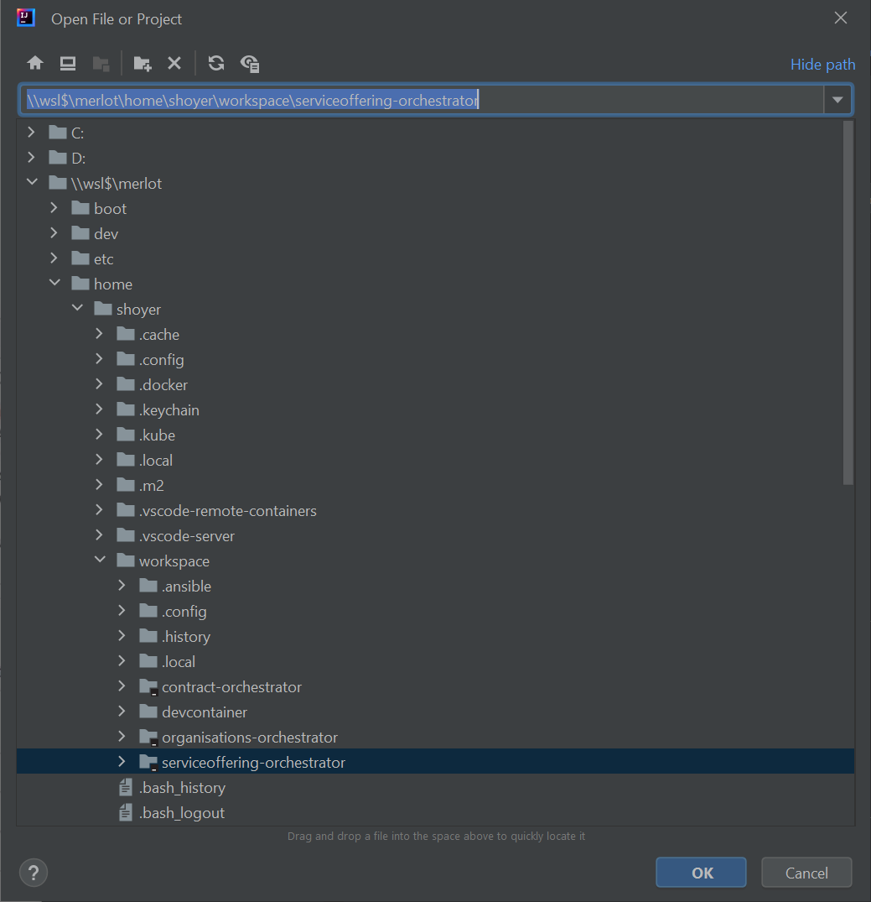

# Setup Windows-Subsystem für Linux (WSL)

Download: [Ubuntu WSL Image](https://cloud-images.ubuntu.com/wsl/jammy/current/ubuntu-jammy-wsl-amd64-wsl.rootfs.tar.gz)

```
wsl.exe --import merlot D:\WSL\MERLOT  .\ubuntu-jammy-wsl-amd64-wsl.rootfs.tar.gz

usermod -a -G sudo shoyer
````

Allow your user to use sudo

`visudo -> shoyer ALL=(ALL) NOPASSWD: ALL`

```
sudo apt update
sudo apt upgrade

echo "[user]" > /etc/wsl.conf
echo "default=shoyer" >> /etc/wsl.conf

sudo apt install openjdk-17-jdk openjdk-17-jre maven
sudo apt install gnupg2 software-properties-common
sudo apt-get install ca-certificates curl gnupg
sudo install -m 0755 -d /etc/apt/keyrings
curl -fsSL https://download.docker.com/linux/ubuntu/gpg | sudo gpg --dearmor -o /etc/apt/keyrings/docker.gpg
sudo chmod a+r /etc/apt/keyrings/docker.gpg
echo \
"deb [arch="$(dpkg --print-architecture)" signed-by=/etc/apt/keyrings/docker.gpg] https://download.docker.com/linux/ubuntu \
"$(. /etc/os-release && echo "$VERSION_CODENAME")" stable" | \
sudo tee /etc/apt/sources.list.d/docker.list > /dev/null
sudo apt-get update
sudo apt-get install docker-ce docker-ce-cli containerd.io docker-buildx-plugin docker-compose-plugin
sudo apt install git git-lfs
sudo apt install keychain

sudo usermod -a -G docker shoyer

echo 'eval $(keychain --eval id_rsa)' >> ~/.bashrc

echo 'RUNNING=`ps aux | grep dockerd | grep -v grep`' >> ~/.bashrc
echo 'if [ -z "$RUNNING" ]; then' >> ~/.bashrc
echo '    sudo dockerd > /dev/null 2>&1 &' >> ~/.bashrc
echo '    disown' >> ~/.bashrc
echo 'fi' >> ~/.bashrc

cd /home/shoyer
mkdir workspace
export MERLOT_WORKSPACE=/home/shoyer/workspace
```

## Visual Studio Code

Install VS Code with the following recommended extensions

https://code.visualstudio.com/download

 * ESLint - Microsoft
 * Python- Microsoft
 * Angular Language Service
 * Prettier - Code Formatter - Prettier

 ```
 ```

## IntelliJ

https://www.jetbrains.com/de-de/idea/download/?section=windows 




